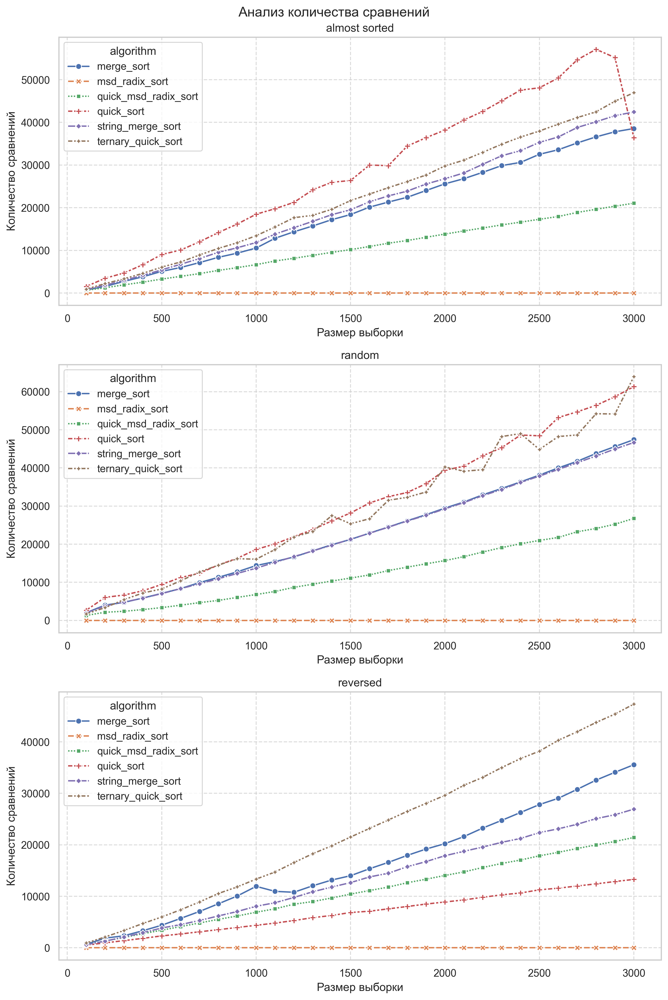
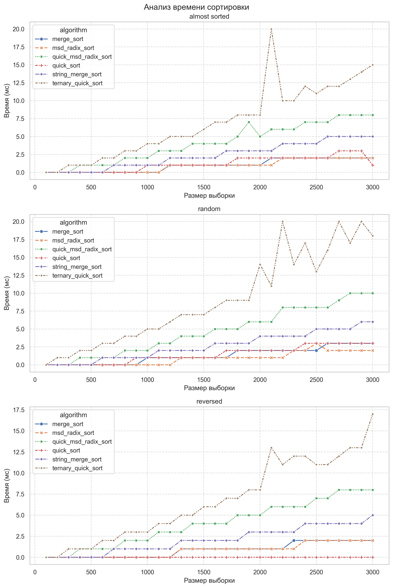

# Анализ алгоритмов сортировки строк

> Автор: Александр Васюков | БПИ-235

Номера посылок на CodeForces:

Задача | Посылка
-------|--------
A1m | 321173932 
A1q | 321174919 
A1r | 321253865
A1rq | 321256315

Исследование алгоритмов сортировки строк на количество посимвольных сравнений и времени выполнения.
1. Quick Sort (`std::sort`)
2. Merge Sort (`std::stable_sort`)
3. String Merge Sort
4. Ternary Quick Sort
5. MSD Radix Sort
6. MSD Radix Sort with Ternary Quick Sort

Алгоритмы реализованы на языке $\text{C++}$.

## Структура проекта

```
A1/
├── analysis
│   ├── analysis.ipynb
│   ├── generate_data.py
│   ├── string_generator.py
├── data/
│   ├── comparisons.png
│   ├── results.json
│   ├── strings.json
│   ├── time.png
│   include/
│   ├── json.hpp
│   ├── msd_radix_sort.h
│   ├── quick_msd_radix_sort.h
│   ├── string_merge_sort.h
│   ├── StringSortTester.h
│   ├── ternary_quick_sort.h
│   ├── TrackedString.h
├── src/
│   ├── msd_radix_sort.h
│   ├── quick_msd_radix_sort.h
│   ├── string_merge_sort.h
│   ├── ternary_quick_sort.h
├── CMakeLists.txt
├── main.cpp
├── README.md
```

## StringSortTester

Реализован класс `StringSortTester` для проведения анализа (подсчёт количества посимвольных сравнений и времени выполнения). Класс содержит следующие функции:

Функция | Что делает | Вход | Выход
--------|------------|------|------
`testAlgorithm` | Производит анализ для выборок различных размеров (от $100$ до $3000$ с шагом $100$). | Название алгоритма и функция (алгоритм сортировки). | -
`analyzeOnData` | Шаблонная функция - вызывает функцию `analyzse` и записывает результат в файл. | Размер выборки, функция (алгоритм сортировки), название алгоритма | -
`analyze` | Шаблонна функция - запускает алгоритм $10$ раз и усредняет результат. | Вектор строк и функция (алгоритм сортировки). | Количество сравнений и время.
`saveResult` | Записывает результат в файл в формате $\text{json}$. | Путь к файлу. | -

Для работы с данными произодится запись результатов анализа в json-файл (используется библиотека $\text{nlohmann::json}$).

## TrackedString

Обёртка над строками для подсчёта количества сравнений в функциях `std::sort` и `std::stable_sort`.

## StringGenerator

Для генерации выборок случайных строк реализован класс `StringGenerator` на языке $\text{Python}$.

Функции:
Функция | Что делает | Вход | Выход
--------|------------|------|------
`generate_string` | Генерация строки случайной длины из случайных символов | Минимальная длина строки, максимальная длина строки | Сгенерированная строка
`generate_prefix_string` | Генерация массива строк с одинаковым префиксом | - | Массив строк
`generate` | Генерация массива строк | - | Массив строк
`generate_sorted` | Генерация отсортрованной выборки | - | Массив строк
`generate_reversed_sorted` | Генерация выборки, отсортированной в обратном порядке | - | Массив строк
`generate_almost_sorted` | Генерация выборки, в которой некоторое количество строк перемешано | - | Массив строк

Json-файл с сгенерированными выборками лежит в директории $\text{data}$.

## Анализ

Обработка полученных данных производится на языке $\text{Python}$ с использованием библиотек $\text{seaborn, Matplotlib.pyplot}$ для визуализации результатов и $\text{json, pandas}$ для обработки данных.

По полученным данным построены графики зависимости количества посимвольных сравнений и времени сортировки от размера выборок для разных алгоритмов и разных типов выборок.

## Результаты

### Анализ количества посимвольных сравнений



На всех видах выборок результаты практически одинаковые.

`MSD Radix Sort` не делает посимвольных сравнений. Этот алгоритм только считает количество вхождений символов.

`MSD Radix Sort with Quick Sort` имеет практически одинаковые результаты независимо от вида выборки.

#### Почти отсортированная выборка

Меньше всего посимвольных сравнений на данной выборке совершает `Quick MSD Radix Sort`, потому что этот тот же самый `MSD Radix Sort`, но с переключением на `Ternary Quick Sort`, если длина строк стала меньше 74.

`Merge Sort`, `String Merge Sort` и `Ternary Quick Sort` справились практически одинаково.

Больше сравнений потребовлаось `Quick Sort`, потому что алгоритм делает сравнения, пока не найдёт различия, а в данной выборке этот особенно заметно, так как она почти отсортрована и необходимо делать много сравнений слов с одинаковым префиксом. Также можно заметить, что при размере выборки $3000$ строк, количество сравнений резко падает - это может быть связано с переключением в $\text{std::sort}$ с `Quick Sort` на `Heap Sort`, который делает меньше сравнений, чем первый.

#### Случайная выборка

Результаты почти аналогичны предыдущим. Главное отличие - больше сравнений необходимо `Ternary Quick Sort`, так как данные случайные и при разбиении выборки на три части выбирается неоптимальный pivot-элемент.

#### Обратно отсортрованная выборка

Можно чётко расставить алгоритмы по количество сравнений от меньшего к большему:

1. MSD Radix Sort
2. Quick Sort
3. MSD Radix Sort with Ternary Quick Sort
4. String Merge Sort
5. Merge Sort
6. Ternary Quick Sort

`Quick Sort` удобен в этом случае, потому что он может брать симметричные элементы и менять их, для чего необходимо примерно $\frac{N}{2}$ сравнений, где $N$ - количество элементов в выборке. 

Очевидно, `Ternary Quick Sort` приходится делать много сравнений, чтобы развернуть всю выборку.

Остальные алгоритмы примерно одинаково сработали, как и в предыдущих случаях.

### Анализ времени выполнения



#### Почти отсортированная выборка и случайная выборка

Результаты на первых двух видах выборок идентичны.

Быстрее всех справились `Quick Sort`, `MSD Radix Sort`, `Merge Sort`. Также неплохой результат у `String Merge Sort`.

Дольше всех работали `Ternary Quick Sort` и `MSD Radix Sort with Ternary Quick Sort`, так как им необходимо делать больше посимвольных сравнений, а также из-за глубокой рекурсии.

#### Обратно отсортрованная выборка

На этой выборке лучше всех справился `Quick Sort` так как ему не надо делать много сравнений в данном случае, а лишь поменять попарно символы - это делает сортировку быстрой. 

В остальном результаты одинаковы - `MSD Radix Sort` и `Merge Sort` справляются чуть быстрее остальных, первый потому, что не надо делать большого количества посимвольных сравнений, второй, потому что сортировка несложная - необходимо при каждом сливании брать элементы правого массива, а затем левого.

## Вывод

1. Количество посимвольных сравнений

- `MSD Radix Sort` принципиально отличается от остальных алгоритмов — он не делает посимвольных сравнений, а работает через подсчёт символов на позициях, что даёт ему преимущество в данном показателе.
- Добавление к `MSD Radix Sort` переключения на `Ternary Quick Sort` увеличивает количество сравнений, но даёт гибрид, лучше работающий на случайных выборках.
- `Quick Sort` делает много сравнений, особенно на почти отсортированных данных с длинными общими префиксами, где каждое сравнение требует просмотра множества символов. Зато он делает значительно меньше остальных алгоритмов сравнений на обратно отсортрованной выборке.
- `Ternary Quick Sort` часто показывает наибольшее количество сравнений, особенно на случайных и обратно отсортированных данных из-за глубокой рекурсии и большого числа сравнений символов для разделения по трём ветвям.
- `Merge Sort` и `String Merge Sort` показывают стабильное среднее количество сравнений — они менее чувствительны к порядку данных, но в целом тратят время на сравнения, поскольку при слиянии нужно сравнивать строки.

2. Время выполнения

- На почти отсортированных и случайных данных быстрее всего работают `Quick Sort`, `MSD Radix Sort` и `Merge Sort`.
- `MSD Radix Sort with Ternary Quick Sort` и `Ternary Quick Sort` работают заметно медленнее из-за большего числа сравнений и рекурсивных вызовов.
- На обратно отсортированных данных `Quick Sort` выигрывает — так как ему достаточно просто попарно поменять элементы, и ему не нужно много посимвольных сравнений.

Итого, наиболее оптимальным оказался алгоритм `MSD Radix Sort` - он делает меньше всего посимвольных сравнений и работает быстро.

Менее полезные алгоритмы для данной задачи, на мой взгляд, `Ternary Quick Sort` и `MSD Radix Sort with Ternary Quick Sort` - они рекурсивные, долгие и первый требует много посимвольных сравнений.