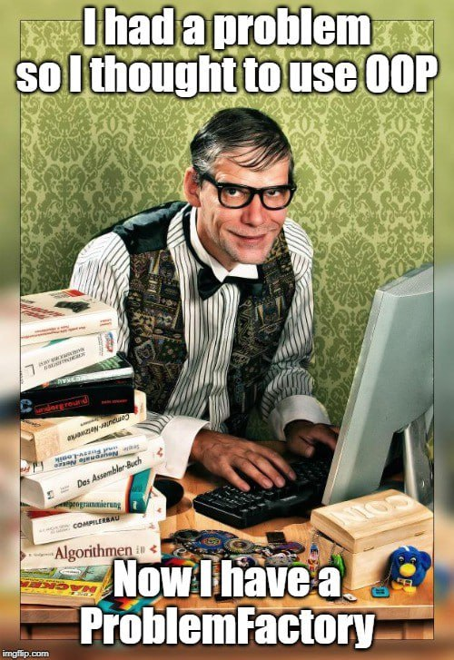

# Software Design | Mini HW 2

Автор: Александр Васюков

## Описание проекта "Zoo Server"

Проект для управления зоопарком, написанный на языке программирования Golang с использованием концепций DDD и принципов Clean Architecture.

Проведено тестирование приложения при помощи инструмента проектирования API Swagger.

Код проекта покрыт юнит-тестами с использованием testify/mock.

## Запуск программы

1. Необходимо установить Go на вашу ОС.
2. Клонирование репозитория и переход в директорию проекта:
   ```bash
   git clone https://github.com/vasyukov1/HSE-FCS-SE-2-year
   cd HSE-FCS-SE-2-year/Software_Design/Homeworks/hw_02
    ```
3. Установка зависимости
   ```bash
   go mod tidy
   ```
4. Инициализация документации Swagger
     ```bash
    swag init -g cmd/zoo/main.go
    ```
5. Запуск проекта
   ```bash
   go run cmd/zoo/main.go
   ```
6. Проведение тестирования кода
   ```bash
   go test -coverprofile=coverage.out ./internal/...
   ```
7. Просмотр покрытого тестами кода
   ```bash
   go tool cover -html=coverage.out
   ```
8. Просмотр процентного покрытия тестами
    ```bash
    go tool cover -func=coverage.out
    ```

## Реализованный функционал

| Функционал                                                            | 	Реализация                                                |
|-----------------------------------------------------------------------|------------------------------------------------------------|
| Добавление, удаление и получение животных                             | AnimalController, AnimalService, AnimalRepository          |
| Обновление статуса животного (больной/здоровый/голодный/накормленный) | AnimalController, AnimalService, animal.Animal             |
| Назначение, удаление, получение расписания кормления                  | FeedingController, FeedingService, FeedingRepository       |
| Редактирование и удаление расписания                                  | FeedingController, FeedingService, feeding.Feeding         |
| Кормление животного                                                   | AnimalService.Feed                                         |
| Добавление, удаление и получение вольеров                             | EnclosureController, EnclosureService, EnclosureRepository |
| Добавление животного в вольер                                         | EnclosureService.AddAnimalToEnclosure                      |
| Статистика зоопарка                                                   | StatsController, StatsService                              |
| Swagger-документация всех маршрутов                                   | Документирующие комментарии в controller/*.go              |
| Юнит-тесты                                                            | *_test.go в internal                                       |
| Domain Events (AnimalMovedEvent, FeedingTimeEvent)                    | internal/domain/events/                                    |

## Применённые концепции DDD и Clean Architecture

1. Domain-Driven Design

|  Концепция      | Реализация                                               |
|-----------------|----------------------------------------------------------|
| Entity          | animal.Animal, enclosure.Enclosure, feeding.Feeding      |
| Value Object    | Gender, HealthStatus, FoodType, EnclosureType            |
| Aggregate Root  | Animal, Enclosure                                        |
| Repository      | AnimalRepository, FeedingRepository, EnclosureRepository |
| Domain Events   | AnimalMovedEvent, FeedingTimeEvent                       |
| Factory methods | NewAnimal, NewFeeding, NewEnclosure                      |
| DTO             | animal, enclosure, feeding, stats                        |

2. Clean Architecture

| Слой	            | Директория проекта                   |
|------------------|--------------------------------------|
| Domain 	         | internal/domain/                     |
| Application      | 	internal/application/services/      |
| Interface        | 	internal/application/interfaces/    |
| Infrastructure 	 | internal/infrastructure/storage/     |
| Presentation     | internal/presentation/controller/    | 
| DTO/Mapping      | 	internal/presentation/dto/          |
| Tests	           | *_test.go в каждом слое и testutils/ |

Все зависимости внедряются через конструкторы (dependency injection).

Swagger подключён через swaggo/swag и gin-swagger.

Использованы testify/mock для мокирования юнит-тестов.

Тестами покрыто 74.5% кода.

